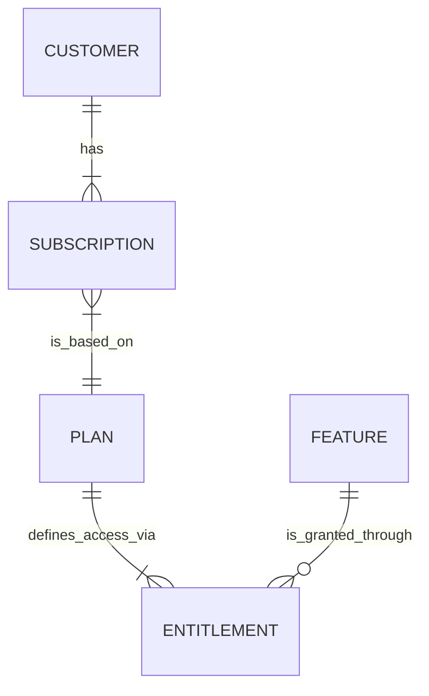

Managing customers is at the heart of ParityDeals. Each customer connects directly to their subscriptions, the plans behind those subscriptions, and the features they’re entitled to. Understanding these relationships is key to managing the full customer lifecycle. The diagram below gives you a high-level view of how everything ties together:

This guide provides a complete overview of how to view, add, edit, and understand individual customer details and their associated subscriptions, entitlements, and usage within ParityDeals.
## Viewing the List of Customers

To access and manage your customer data, select the **Customers** section from the main left navigation pane in the ParityDeals dashboard.

*[Image: The main ParityDeals navigation sidebar with the "Customers" section clearly highlighted.]*

This action displays the "Customers" list page. From this screen, you can:
* **Search:** Use the search bar to quickly find a specific customer by name, email, or identifier.
* **Add a new customer:** Click the "+ New customer" button to create a new customer record.
* **Manage individual customers:** Click on any customer's row in the list to navigate to their detailed information page.

*[Image: The main "Customers" list page. This image should show: a prominent search bar at the top, the "+ New customer" button, and a table or list of existing customers with columns such as Name, Identifier, Email, and perhaps a status or creation date.]*

---

## Adding a New Customer

To manually add a new customer record to ParityDeals:

1.  On the "Customers" list page, click the **"+ New customer"** button, located in the top-right corner.
    *[Image: A close-up of the "Customers" list page with the "+ New customer" button clearly highlighted.]*
2.  The "Create customer" modal window will appear. You need to fill in the following details:
    * **Customer name *:** (Required) Enter the full name of the individual customer or their company name.
    * **Identifier:** This unique ID is used by ParityDeals to reference the customer internally and via the API. It is auto-generated based on the customer name; however, you can edit it before creation. It's recommended to use this identifier to link to an existing customer ID in your own system if applicable.
    * **Email address (optional):** Enter the customer's primary email address.
    *[Image: The "Create customer" modal, showing all input fields: "Customer name" (with sample text), "Identifier" (showing an auto-generated ID and indicating it's editable), and "Email address" (optional, with sample text).]*
3.  **Create multiple customers:** If you need to add several customers consecutively, enable the **"Create more"** toggle switch (this is off by default). When "Create more" is enabled, after you click "Create," the modal will remain open and reset its fields, allowing you to immediately enter the next customer's details.
    *[Image: The "Create customer" modal, specifically highlighting the "Create more" toggle switch. Consider showing it in both its 'off' (default) and 'on' states if possible, or clearly indicating its function.]*
4.  Once all required details for a customer are entered, click the **"Create"** button located at the bottom-right corner of the modal.
    *[Image: The bottom-right corner of the "Create customer" modal with the "Create" button clearly highlighted.]*
5.  Upon successful creation, a success toast notification will briefly appear. If the "Create more" toggle was not enabled, the modal will close, and the newly added customer will appear in the "Customers" list.

    *[Image: An example of a success toast notification, such as "Customer 'Arcade Solutions' created successfully."]*

---

## Managing Existing Customers

From the "Customers" list page, you can perform several actions on existing customer records, including editing their information or archiving them.

### Editing a Customer

To modify a customer's details:

1.  Navigate to the "Customers" list page.
2.  Locate the customer whose information you wish to edit. You can use the search bar if needed.
3.  Click the **three-dot menu icon** (...) on the right side of that customer's row in the list.
4.  Select the **"Edit"** option from the dropdown menu that appears.
    *[Image: A row in the customer list with the three-dot menu icon expanded, clearly showing the "Edit" option highlighted.]*
5.  The "Edit customer" modal will appear. In this modal, you can change the **Customer name** and **Email address**. The Identifier is not editable after creation.
    *[Image: The "Edit customer" modal, showing the "Customer name" and "Email address" fields populated with existing data and ready for editing. The "Identifier" field should be shown as read-only or absent. A "Save changes" button should be visible.]*
6.  After making your changes, click **"Save changes"** to apply them.

### Archiving a Customer

Archiving a customer makes them inactive in the system and revokes their access.

1.  Navigate to the "Customers" list page.
2.  Locate the customer you wish to archive.
3.  Click the **three-dot menu icon** (...) on the right side of that customer's row.
4.  Select the **"Archive"** option from the dropdown menu.
    *[Image: A row in the customer list with the three-dot menu icon expanded, clearly showing the "Archive" option highlighted.]*
5.  A confirmation modal will appear with the message: "Are you sure you want to archive this customer? Once archived, they will lose access to all features."
    *[Image: The "Archive Customer" confirmation modal, displaying the warning message and two distinct buttons: "Confirm" (or "Archive") and "Cancel".]*
6.  To proceed, click the **"Confirm"** (or "Archive") button on the modal. The customer will then be archived.

<Warning>
**Important:** You cannot archive a customer who has an active or paid subscription. You must first cancel or otherwise resolve their existing subscriptions before you can archive their record.
</Warning>

---

## Customer Details Page

To view and manage all information and activity related to a specific customer, click on their row in the "Customers" list page. This action navigates you to their individual "Customer Details" page.

*[Image: An overview of a sample Customer Details page, showing different clearly labeled sections or cards for "Billing ID", "Dates", "Subscriptions", "Entitlements", and "Usage".]*

This page consolidates all data, including:

* **Billing ID:** The customer's unique billing identifier, if applicable (e.g., the ID from a connected payment gateway like Stripe).
    *[Image: A specific section or field on the Customer Details page clearly labeled "Billing ID" and showing an example ID.]*
* **Created / Last updated date:** Timestamps indicating when the customer record was created in ParityDeals and when it was last modified.
    *[Image: A specific section on the Customer Details page displaying "Created date" and "Last updated date" with example timestamps.]*

### Subscriptions
This section lists all current and past subscriptions associated with the customer.
* If the customer has no subscriptions, this section will display an empty state message.
    *[Image: The "Subscriptions" section on the Customer Details page showing a clear empty state message, e.g., "This customer has no active or past subscriptions."]*
* For each subscription, key details such as the plan name, current status (e.g., Active, Trialing, Canceled), and relevant term dates (start, end, renewal) are displayed.
    *[Image: The "Subscriptions" section populated with a list of one or more example subscriptions, each row showing details like Plan Name, Status, Start Date, and End Date/Renewal Date.]*
* You will be able to add a new subscription directly to the customer from this page. (`This functionality is currently in development`)
    *[Image: A placeholder image or mock-up showing a "+ Add Subscription" button (perhaps greyed out or with an "In Development" annotation) within the Subscriptions section of the Customer Details page.]*

### Entitlements
This section provides a clear overview of all the specific features and their configurations (entitlements) that the customer currently has access to, derived from their active subscriptions.
*[Image: The "Entitlements" section on the Customer Details page, showing a list of features (e.g., "Premium Support," "API Calls," "Number of Projects") and their corresponding entitlement status or limit (e.g., "Enabled," "10,000/month," "5 out of 10 Used").]*

### Usage
This section offers insights into how the customer is consuming their metered (usage-based) entitlements.
* You will see a graph and/or tabular data representing usage over time for relevant features.
    *[Image: An overview of the "Usage" section on the Customer Details page. This should feature a sample usage graph (e.g., a line or bar chart showing consumption over time) and perhaps a summary table below it for specific metered features.]*
* You can hover over specific points on the graph or elements in the data tables to see more detailed usage information for specific entitlements or particular time periods.
    *[Image: A close-up of the usage graph within the "Usage" section, demonstrating a tooltip or detailed information panel appearing when the user hovers over a data point or bar on the chart.]*