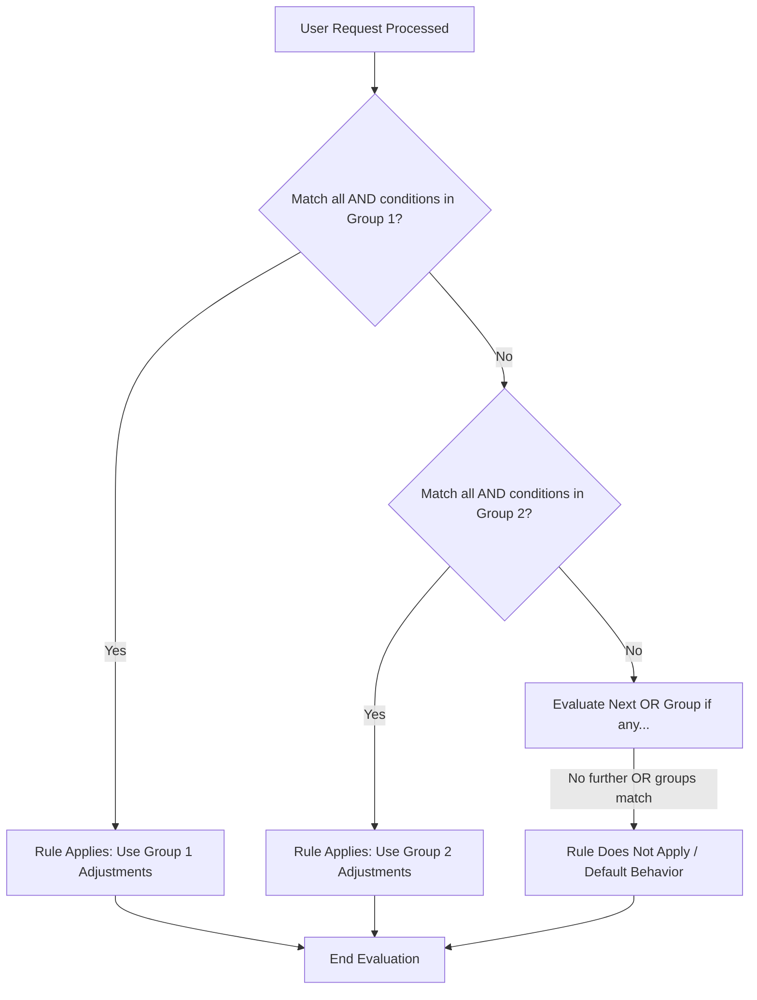
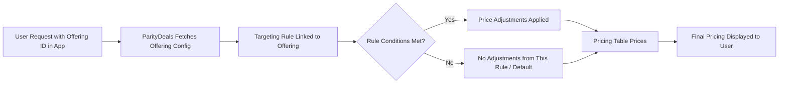

## What are Targeting Rules?

Targeting Rules in ParityDeals are a sophisticated feature designed to empower you to present **specific Offerings (which include unique dynamic pricing based on PPP groups, country) to distinct customer segments.** By defining rules based on customer attributes, you can tailor your pricing and product presentation dynamically, ensuring the right customers see the most relevant and effective offers.

This powerful capability allows you to:
* **Implement Granular Pricing Strategies:** Based on customer behavior, demographics, or geographic location.
* **Maximize Customer Lifetime Value (LTV):** By optimizing pricing for different segments.
* **Enhance Pricing Table Effectiveness:** By showing more relevant plans and pricing, increasing conversion rates.

Supported attributes for creating these rules include:
* **Any audience:** A default or catch-all segment.
* **Country:** Target users based on their geographical location.
* **PPP group:** Group countries by Purchasing Power Parity to offer regionally appropriate pricing.
* **Platform / OS:** Target based on the operating system (e.g., iOS, Android, Windows, macOS). (`Coming soon`)
* **Browser:** Target based on the web browser being used (e.g., Chrome, Safari, Firefox). (`Coming soon`)

<Frame>
        
</Frame>  
---

## Creating and Defining Targeting Rules

You create, view, and manage your Targeting Rules directly from the ParityDeals dashboard.

1.  From the main sidebar navigation, go to **Monetization > Targeting Rules**.
2.  On the "Targeting Rules" page, click the **"+ Create rule"** button, located in the top-left corner.
    <Frame>
        
    </Frame>  

This action opens a dedicated page where you will define all aspects of your new rule.

### Step 1: Rule Information

Begin by providing the basic identifying information for your rule. This helps you organize and manage your rules effectively.

* **Rule Name:** Click into the rule name field and enter a clear, descriptive name. This name is for your internal reference.
    * **Example:** "PPP Discount - Tier 3 Countries," "EU Early Adopter Offer," "USA - Standard Pricing."
     <Frame>
        
    </Frame>  
* **Select Product(s):** Click the dropdown field to choose one or more products from your catalog to which this rule's pricing adjustments will apply. You can search by product name or ID.
    <Frame>
        
    </Frame> 
<Info>
A Targeting Rule only becomes active and influences customer experiences once it is connected to an **Offering**.
</Info>

### Step 2: Setting Conditions

This is the core of your Targeting Rule. Here, you define the specific customer attributes that must be met for the rule (and its associated pricing adjustments) to apply.

#### Condition Logic: "If the customer matches..."
1.  Click on the "If the customer matches *" to begin defining your first condition.
2.  **Select Condition Type:** Choose an attribute from the dropdown menu.
    * **Any audience:** A broad condition for setting a default rule that applies if no other more specific rule matches a user.
    * **Country:** Target users based on their geographic location, detected via IP address.
    * **PPP group:** Target users based on the Purchasing Power Parity of their country.
    * **Platform / OS:** (`Coming soon`)
    * **Browser:** (`Coming soon`)
    <Frame>
        
    </Frame> 
3.  **Select Operator:** Choose how the condition should evaluate the selected attribute:
    * **`is any of`**: The rule applies if the customer's attribute matches *at least one* of the values you specify. For example, if "Country `is any of` [India, Brazil, Nigeria]," the rule applies if the user is in India OR Brazil OR Nigeria.
    * **`is not any of`**: The rule applies if the customer's attribute does *not match any* of the values you specify. For example, if "Country `is not any of` [USA, Canada]," the rule applies if the user is in any country *except* the USA or Canada.
    <Frame>
        
    </Frame>   
4.  **Select Value(s):** Based on the condition type and operator, select the specific values.
    * If you selected "Country," a multi-select dropdown appears where you can search for and choose specific countries.
    <Frame>
        
    </Frame>     
    * If you selected "PPP group," select from predefined PPP groups in the dropdown.
    <Frame>
        
    </Frame> 

#### PPP Groups
Purchasing Power Parity (PPP) targeting is a strategic way to offer your product at prices more aligned with local economic conditions, significantly boosting global accessibility and adoption.

* **What they are:** Countries are categorized into groups (tiers) based on their relative purchasing power compared to a benchmark (often the US Dollar). A lower PPP index signifies that the local currency has less purchasing power.
* **Example Groups (Illustrative - groups in ParityDeals are predefined):**
    * **High PPP (e.g., Index 0.7-1.0+):** Includes countries like the USA, Switzerland, Norway, Western European nations, Canada, Australia. (These countries usually receive standard/baseline pricing).
    * **Mid PPP (e.g., Index 0.4-0.69):** May include countries in Southern/Eastern Europe, parts of Latin America, and some Southeast Asian nations. (These countries may receive a moderate discount).
    * **Low PPP / Frontier Markets (e.g., Index 0.2-0.39):** Could include countries like India, Pakistan, Nigeria, Bangladesh, and many nations in Africa and other parts of LATAM/SE Asia. (These countries may receive a significant discount).
* **Benefits for SaaS Companies using PPP-based pricing:**
    * **Increased Global Market Penetration:** Access and convert users in developing economies.
    * **Improved Affordability & Higher Adoption Rates:** A lower price barrier leads to more sign-ups and usage.
    * **Enhanced Competitive Advantage:** Offer fairer, more attractive pricing than competitors who use a single global price.
    * **Ethical and Customer-Centric Pricing:** Align the value delivered with local economic realities.

#### Defining Price Adjustments
Once your conditions are set, specify how the pricing should change for customers who match this rule:
1.  From the "Then" section of the condition block, choose either **"Increase price by"** or **"Decrease price by"** from the dropdown menu.
    <Frame>
        
    </Frame> 
2.  Enter the **percentage** value for the adjustment (e.g., `20` for a 20% change) in the adjacent input field.
    <Frame>
        
    </Frame> 
* **When to use "Decrease price by":**
    * **PPP Adjustments:** To make products more affordable in lower PPP regions.
    * **Promotional Pricing:** To target specific new markets or regions with introductory discounts.
    * **Segment-Specific Offers:** To provide discounts for defined user groups (e.g., educational, non-profit, based on custom attributes if supported).
    * **Benefit:** Increases accessibility, drives adoption in price-sensitive markets, and can boost sales volume.
* **When to use "Increase price by":**
    * **Premium Segments:** If you identify user segments with a higher willingness to pay.
    * **Value-Based Pricing:** For regions where your product offers exceptionally high value or has few local competitors.
    * **Cost Adjustments:** To account for higher operational costs or specific taxes in certain regions if not handled separately.
    * **Benefit:** Optimizes revenue in markets where higher prices are sustainable.

#### Combining Multiple Conditions
You can create highly specific targeting rules by layering multiple conditions.

* **AND Logic:** To add more criteria that *must all be met* for the rule to apply, click the **"+ AND"** button within the same condition block. Each new condition added this way narrows the target segment.
    * **Example:** "If customer is in `PPP Group: Low PPP` **AND** Country `is any of` [India]".
    <Frame>
        
    </Frame>    
    * **Precedence with AND:** When building complex rules with multiple AND conditions that might appear to overlap (e.g., a country is in a selected PPP group, AND that same country is also specifically targeted with a different adjustment), rules are evaluated based on their defined order or specificity. **It is highly recommended to test complex rule interactions thoroughly to confirm the exact behavior and ensure they produce the desired outcome before activating them for live offerings.**
    <Frame>
        
    </Frame>    
* **OR Logic:** To apply the same price adjustment to several distinct customer segments, click the **"+ Add condition group (OR)"** button. This creates a new, independent block of conditions. The rule will apply if a customer matches *all* conditions in Group 1 **OR** *all* conditions in Group 2, etc.
    * **Example:** "(If Country `is any of` [USA, Canada]) **OR** (If Country `is any of` [UK, Germany] **AND** Browser `is any of` [Chrome])".
    <Frame>
        
    </Frame> 
    The evaluation of combined AND/OR conditions follows a structured logic. The diagram below illustrates a simplified flow where a rule applies if either "Condition Group 1" (which itself might contain multiple AND conditions) OR "Condition Group 2" is met:

<Info>
Support for targeting by **Platform / OS** and **Browser** is planned for a future release.
</Info>

#### A/B Testing with Variants (`Coming soon`)
ParityDeals will allow you to create multiple variants within a single Targeting Rule (e.g., Variant A with a 10% discount, Variant B with a 15% discount). This will enable you to A/B test different pricing adjustments for the same customer segment to determine which performs best. This feature is `Coming soon`.

<Frame>
        
</Frame> 
### Step 3: Creating the Rule

<Warning>
**Crucial Note:** Once a Targeting Rule is created and saved, its **conditions and price adjustments cannot be altered**. This restriction is in place to maintain the integrity and consistency of your analytics and reporting based on these rules. You can, however, edit the rule's name later if needed. Therefore, please plan and review your conditions meticulously before creating the rule.
</Warning>

1.  After you have carefully defined your rule name, selected the product(s), and set all conditions and price adjustments, click the **"Create rule"** button, located at the bottom of the page.
    *[Image: The bottom of the Targeting Rule creation page with the "Create rule" button clearly highlighted.]*
    <Frame>
        
    </Frame> 

---

## Linking Targeting Rules to Offerings

Creating a Targeting Rule defines the logic, but it doesn't activate it for your users. To make a rule live, you must link it to an **Offering**. An Offering is what connects your Targeting Rules (and/or Pricing tables) to your users. These entities work together in a sequence to deliver dynamic pricing:

After successfully creating a Targeting Rule, you will be directed to the Offering creation page, with the "Create offering" modal appearing and your newly created rule pre-selected.

<Frame>
        
</Frame> 
1.  **In the "Create offering" (or "Edit offering") modal:**
    * **Pricing Table Linking (Optional):** An option exists to "Skip if you don't want to link a pricing table to this offering." If your Offering's purpose is *only* to apply rule-based price adjustments without using the pricing table, you can skip this.
    * If you select a **pricing table** you will only be able to select a Targeting Rule that is associated with that pricing table.
    * **Assign to Targeting Rule:** Ensure **"Targeting Rule"** is selected as the assignment type.
    * **Select Targeting Rule:** The dropdown will automatically have your newly created rule selected. If you are editing an existing offering or creating a new one independently, choose the desired rule from this list.
2.  Click **"Create"** (or "Update") on the Offering modal.

This action creates (or updates) the Offering and effectively activates your Targeting Rule. You will then see the **Offering ID** in the modal.

* **Offering ID:** This ID is essential. Copy this ID and paste it into your application's code where you initialize the ParityDeals SDK or render the pricing table component. This `Offering ID` instructs your application to apply the dynamic pricing and pricing table configuration determined by the linked Targeting Rule.

    <Frame>
        
    </Frame> 

---

## Managing Targeting Rules and Offerings Post-Creation

While rule conditions are immutable, you retain flexibility in managing your targeting strategies through rule naming and Offering edits.

### Editing Targeting Rule Names
To maintain clarity and organization, you can edit the name of a Targeting Rule after its creation. The rule's conditions and price adjustments remain unchanged.
1.  Navigate to **Monetization > Targeting Rules**.
2.  Locate the rule you wish to rename in the list.
3.  Click the **three-dot menu icon** on that rule's row and select **"Edit"**.
    <Frame>
        
    </Frame> 
4.  Modify the name in the input field and save your changes.

### Editing Offerings to Change Targeting Rules or Pricing Tables
The primary way to manage and iterate on your live targeting strategies is by editing the **Offering**. This approach provides significant flexibility without requiring code changes in your application.

<Info>
  **No Code Changes Needed for Iteration!**
  This system is specifically designed so that Product Managers, Go-To-Market teams, and Sales teams can dynamically update pricing strategies. You can roll out new pricing tables, switch which Targeting Rule an Offering uses, or adjust the pricing table linked to an Offering, all from the ParityDeals dashboard. The Offering ID in your application remains the same, ensuring seamless updates.
</Info>

1.  Navigate to **Monetization > Offerings**.
2.  Find the Offering you wish to modify in the list.
3.  Click  "**Edit**" icon.
    <Frame>
        
    </Frame> 
4.  In the "Edit offering" modal, you can:
    * Select a **different Targeting Rule** from the dropdown to change the pricing logic applied.
    * Select a **different Pricing Table** from the dropdown to change the visual presentation.
     <Frame>
        
    </Frame> 
5.  Click **"Update"**. The Offering ID embedded in your code remains unchanged, but it now serves the new configuration (new rule and/or new pricing table) to your users.
