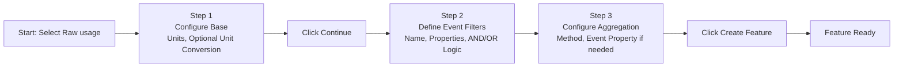
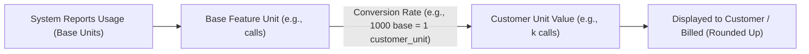

## What is a Feature?

In ParityDeals, a **Feature** is a distinct piece of functionality in your product that can be packaged, monetized, and controlled. It is the core capability that you offer to your users. Think of features as the "nouns" of your product, such as:

* "Premium Analytics"
* "API Access"
* "Team Seats"
* "Dark Mode"

While a feature is the *thing* itself, an **Entitlement** is the *rule* that grants that feature to a customer as part of a **Plan**. The entitlement defines *how* a plan gets access to a feature—whether it's turned on or off, or available up to a certain limit.

<Frame>

</Frame>
This guide focuses on creating and managing the features themselves, which are the fundamental building blocks of your entire monetization strategy.

---

## Creating a Feature

You can create and manage all features from one central location.

1.  From the main sidebar, navigate to **Product Catalog > Features**.
2.  Click the **"+ Create feature"** button in the top-right corner.

 <Frame>

</Frame>

3.  In the "Create feature" modal, fill in the following primary details:
    * **Feature name:** A customer-friendly name. Think of this as the default label your customers will see in paywalls and other UIs.
    * **Identifier:** A unique ID used to reference this feature in your code. This is auto-generated from the name but can be overridden at the time of creation.
    * **Description (optional):** An internal description for your team's reference.

    <Frame>
    
    </Frame>

4.  Select a **Feature type**, which determines how access and usage of the feature are controlled.

---

## Feature Types

ParityDeals supports three types of features to model any business logic.

<CardGroup cols={3}>
  <Card title="Switch (Boolean)" icon="toggle-off">
    The simplest type: the feature is either completely ON or OFF for a given plan.
  </Card>
  <Card title="Customizable" icon="gear">
    Access is defined by a specific numeric limit (e.g., 10 seats).
  </Card>
  <Card title="Metered" icon="chart-bar">
    Access is based on consumption, tracked via pre-aggregated totals or as raw events.
  </Card>
</CardGroup>

### Switch / Boolean

A Switch feature is for simple, all-or-nothing access. It's perfect for functionality that doesn't have a quantity associated with it.

* **Examples:** "Enable Single Sign-On (SSO)," "Access to Advanced Reporting," "White-labeling."

To create one, select **Switch/boolean** as the feature type and click **"Create"**.

<Frame>
    
</Frame> 

### Customizable

A Customizable feature grants access up to a specific numeric limit that you define when adding it to a plan.

* **Examples:** Maximum number of `team members`, `projects`, or `connected accounts`.

To create one, select **Customizable** as the feature type.

#### Feature Units
For Customizable and Metered features, you can define how the unit of value is described to customers.
* Click the pencil icon next to the "Feature unit" field.
* Enter the singular and plural forms (e.g., "Project" and "Projects"). This ensures the unit is displayed grammatically correct in all UIs.

<Frame>
    
</Frame> 

After configuring units, click **"Create"**.

### Metered

A Metered feature is for anything you want to bill based on consumption. This is the foundation of usage-based billing. ParityDeals supports two ways to track usage:

* **Pre-aggregated usage:** Your application sends ParityDeals a total usage count periodically. Think of this as telling us the final score of a game.
* **Raw events:** Your application sends individual events as they happen, and ParityDeals aggregates them for you. This is like sending us the play-by-play so we can calculate the score.

#### Pre-aggregated Usage
Select this option when your system already calculates total usage for a user.

1.  Select **Metered** as the feature type, then choose **Pre-aggregated usage**.
2.  Optionally, customize the initial **Feature unit** (singular/plural).
3.  You can also toggle on **"Use different feature units for customers"**. When this is enabled, it reveals options to edit the base **Feature unit** (e.g., `call`/`calls`), a customer-facing **Customer unit value** (e.g., `k call`/`k calls`), and the **Internal unit conversion** rate between them. For a detailed explanation of how this conversion works, refer to the "Understanding Unit Conversion" section.
4.  Click **"Create"** to finish.

<Frame>
    
</Frame> 

#### Raw Usage
Select this option when you want ParityDeals to calculate usage totals based on an event stream. The creation process involves several key stages:

1.  Select **Metered** as the feature type, then choose **Raw usage**.
2.  Optionally, customize the initial **Feature unit**. You can also toggle on **"Use different feature units for customers"** to reveal and set the base **Feature unit**, a customer-facing **Customer unit value**, and the **Internal unit conversion** rate.
3.  Click **"Continue"**. This will take you to the event configuration screen.
4.  **Define Event Filters:** Specify which events should count towards usage. You can filter by `event name` and add other properties from the event payload.
    * Conditions *inside* a single filter group must *all* be true **(AND)**.
    * You can add *more* filter groups. An event only needs to match one of these *entire groups* **(OR)**.

    <Frame>
    
    </Frame> 

5.  **Configure Aggregation:** Specify how ParityDeals should calculate a single value from the filtered events. All methods besides `Count` require you to select an event property to aggregate.
    * **Example:** To bill for data transfer, you could `Sum` the value of the `bytes_transferred` property on each event.

    <Frame>
    
    </Frame> 

6.  Click **"Create"** to save the feature and its aggregation rules. You will see a success screen.

<Frame>
    
</Frame> 

---

## Understanding Unit Conversion

For metered features, you can present usage to customers in a more readable format than what you use for internal tracking. For example, you might track usage by the `call` but want customers to see their usage and pricing in terms of `thousands of calls`.

The relationship and flow of data for unit conversion can be visualized as:

To do this, toggle on **"Use different feature units for customers"** during feature creation or editing. This reveals three key fields to configure this relationship:

* **Feature unit:** This is the base unit that your system reports to ParityDeals (e.g., singular `call`, plural `calls`).
* **Customer unit value:** This is the customer-facing unit name (e.g., singular `k call`, plural `k calls`).
* **Internal unit conversion:** This is the conversion rate. For example: `1` customer-facing "k call" equals `1000` base "calls".

<Warning>
**Important:** Changing the conversion rate is only possible when there are no active subscriptions using this feature.
</Warning>

When this setup is enabled, your system reports usage to ParityDeals in the base unit (`calls`), but all displays within ParityDeals (like paywalls and customer portals) and data sent to billing systems will use the customer-facing unit (`k calls`).

<Info>
  **Billing and Rounding:** When integrated with a billing provider, the customer-facing units are **rounded up** to the nearest integer. If a customer uses 200 calls (which is `0.2` k calls, if 1 k call = 1000 calls), they will be billed for the full `1` k call.
</Info>

<Frame>
    
</Frame> 
---

## Managing Features

### Editing Feature Details

You can edit a feature's name, description, and other properties after it's been created.

<Warning>
**Note:** Core properties like the feature's **Identifier** and **Type** (Switch, Customizable, Metered) cannot be modified after creation.
</Warning>

1.  From the features list, click the **three-dot menu** on any feature and select **"Edit"**. Alternatively, click the feature to go to its detail page and edit from there.
2.  Make your changes in the appropriate fields.
3.  Click **"Save updates"** to apply the changes.

<Frame>
    
</Frame> 

### Archiving Features

When you no longer want to offer a feature to new customers, you can archive it.

<Warning>
It's not possible to archive a feature if it's currently used by any **published** plan. To archive it, you must first remove it from those plans and publish the updates.
</Warning>

When a feature is archived:
* It will no longer appear in the main feature list.
* It cannot be added to any new plans or add-ons.
* **Existing customers** who already have the feature through an active subscription **will not be affected.**
* The feature's unique identifier is still considered "in-use" and cannot be used for a new feature.

To archive a feature, click the **three-dot menu** from the feature list and select **"Archive"**. Confirm the action in the dialog.

<Frame>
    
</Frame> 