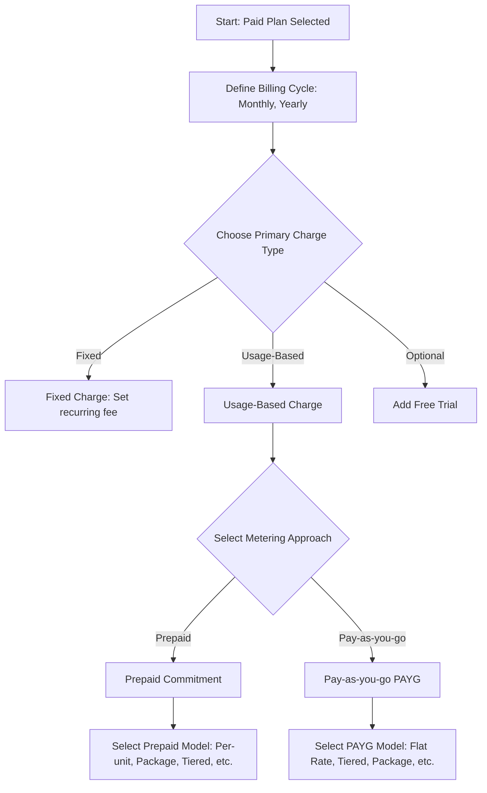
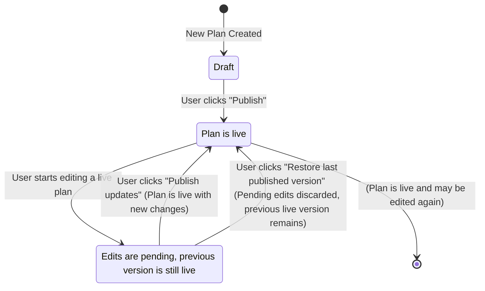

## What is a Plan?

A **Plan** is the commercial package that you offer to your customers. It defines exactly how you monetize your product by bringing together a specific **pricing model**, a set of **features**, and optional **add-ons**. This document provides a complete guide to the entire lifecycle of a plan, from creation and configuration to publishing and management.

---

## Viewing All Plans

To see a comprehensive list of all plans from all of your products, select the **Plans** sub-section from the **Product Catalog** in the left navigation pane. This global view is useful for managing your entire pricing structure in one place.

*[Image: The main navigation sidebar with "Product Catalog" expanded and "Plans" highlighted.]*

*[Image: The global Plans page showing a list of all plans from different products.]*

---

## Creating a Plan

You can create a plan from two primary locations:

1.  Directly from a **Product's detail page** to ensure it's linked to that specific product.
2.  From the global **Plans** tab in the main sidebar navigation.

This guide follows the recommended flow of creating a plan from within a product.

### Step 1: Start from the Product Page

After creating a product, you will see a prompt to create your first plan. Click the **"+ Create plan"** button.

*[Image: The product detail page with the "Ready, set, plan!" message and a "+ Create plan" button highlighted.]*

### Step 2: Define the Plan Details

A "Create plan" modal will appear. Fill in the following details:

* **Plan name:** The public name for the plan (e.g., "Starter", "Pro", "Basic").
* **Identifier:** A unique ID for the plan, used to reference it in your code. This is auto-generated but can be overridden.
* **Description:** An optional description that appears on customer-facing elements like invoices and checkout pages.
* **Show this plan...:** Check this box if you want the plan to appear in the ParityDeals pricing table component.

<Tip>
  To create multiple plans quickly, keep the **"Create more"** toggle enabled. When you click "Create", the modal will reset, ready for the next plan's details.
</Tip>

*[Image: The "Create plan" modal with all fields filled out before clicking Create.]*

### Step 3: Review Your Draft Plans

Once created, your plans will appear on the product's detail page in a **Draft** state. A draft plan is not yet live and can be safely configured before you publish it.

*[Image: The product page showing newly created "Basic" and "Starter" plans in a draft state.]*

---

## Configuring a Plan

Click on any draft plan to navigate to its detail page. From here, you will set its price, add features, and associate add-ons.

*[Image: The plan detail page showing sections to set price, add features, add-ons, and metadata.]*

### Step 1: Set the Price

Click the **"Set price"** button to begin. 

*[Image: The 'Set price' button highlighted on a draft plan's detail page.]*

A modal will appear asking you to choose the fundamental plan type.

*[Image: The "Set price" modal with options for Free, Paid, and Enterprise/custom.]*

You have three options for the plan type:

<CardGroup cols={3}>
  <Card title="Free">
    Customers can subscribe to this plan without any charge. Ideal for "Freemium" or "Starter" tiers.
    <Warning>To offer a **free trial** for a limited time, you must select the **Paid** plan type.</Warning>
  </Card>
  <Card title="Paid">
    Customers will be charged for this plan based on the pricing you configure (e.g., a recurring fee or usage).
  </Card>
  <Card title="Enterprise/Custom">
    `Coming Soon` — For plans that require custom contracts and manual invoicing.
  </Card>
</CardGroup>

After choosing a plan type and confirming, a success message will appear, and you can proceed with further configuration.

*[Image: The plan detail page after a price has been set, with a success message.]*

### Step 2: Configure the Pricing Model (for Paid Plans)

If you selected a **Paid** plan, you will first define the **Billing Cycle**. After setting the cycle, you can add different types of charges. The decision process for structuring these charges can be visualized as follows:

<CardGroup cols={1}>
  <Card title="Fixed Charges" icon="tag" href="#fixed-charges">
    A recurring flat fee that customers are billed for each billing period. This is often used as the base price for a subscription tier.
  </Card>
  <Card title="Usage-Based Charges" icon="chart-bar" href="#usage-based-charges">
    Fees that customers pay based on their consumption of specific features. You can add one or more usage-based charges to a plan.
  </Card>
  <Card title="Free Trial" icon="gift" href="#free-trial">
    Allows customers to use a paid plan for free for a specific duration, with rules for what happens when the trial ends.
  </Card>
</CardGroup>

---

## Charge Type Details

This section provides detailed configuration steps for each charge type.

### Fixed Charges

A **Fixed Charge** is a recurring flat fee that customers are billed for each billing period. It serves as the stable, predictable base price of a plan.

<Info>
A plan can only have one fixed charge. Prices are initially set in USD and can be localized into other currencies later.
</Info>

To add a fixed charge:
1. From the plan's detail page, click **"+ Configure pricing"** and select **"Fixed charge"**.
2. Enter the charge amount for each allowed billing period, for example, `$10` for monthly and `$100` for yearly.
3. Click **"Add"** to save the charge.

*[Image: The 'Set fixed charge' modal showing price inputs for different billing periods.]*

### Usage-Based Charges

**Usage-Based Charges** are fees that customers pay for their consumption of specific product features. A single plan can have multiple distinct usage-based charges.

The first step is always to **select the billable feature** you want to charge for. If the feature doesn't exist yet, you can type its name in the dropdown and create it on the fly.

*[Image: Selecting or creating a new billable feature from the dropdown menu.]*

Once a feature is selected, you must choose how customers will be charged for it:

*[Image: The modal asking to choose between 'Prepaid Commitment' and 'Pay-as-you-go'.]*

#### Prepaid Commitment
Customers are billed **upfront** for a specified quantity of usage (like seats or API calls). This model is ideal for creating predictable, recurring revenue from committed customer spend.

<Info>
  **Proration for Upgrades:** When a customer increases their commitment mid-billing period, they are immediately charged a prorated amount for the remainder of the current period. The full, increased amount is charged in subsequent billing cycles.
</Info>

<Tabs>
<Tab title="Per-unit">
  
Customers commit to a number of units and pay a fixed rate for each one.

  
For example, if the price is `$10` per seat, a customer who commits to `5` seats will pay `$50` at the start of each billing period.

  
To configure this, enter the flat rate per unit. You can also define if usage resets each billing period and set optional minimum or maximum commitment limits. Click `Add` to save.

  *[Image: Configuring the per-unit prepaid model inside its modal.]*
</Tab>
<Tab title="Package">
  
Customers commit to one or more packages of units, where each package contains a predefined number of units for a set price.

  
For example, if you sell seats in packages of `5` for `$40`, a customer needing `8` seats must commit to two packages (a total of 10 seats) and will pay `$80` upfront.

  
To configure this, enter the number of units per package and the price per package. Click `Add` to save.

  *[Image: Configuring the package prepaid model inside its modal.]*
</Tab>
<Tab title="Tiered">
  
The price per unit decreases as the committed volume increases. The total cost is calculated by summing the cost of the units in each tier.

  
For example, if 1-10 units cost `$10` each and 11-50 units cost `$8` each, a commitment of `15` units costs (`10` units x `$10`) + (`5` units x `$8`) = `$140`.

  
To configure this, define the usage range and price per unit for each tier. Click `Add` to save.

  *[Image: Configuring the tiered prepaid model inside its modal.]*
</Tab>
<Tab title="Volume">
  
The price for ALL committed units is determined by the single pricing tier that the total volume falls into.

  
For example, if Tier 1 (1-10 units) is `$10`/unit and Tier 2 (11-50 units) is `$8`/unit, a commitment of `15` units means all `15` units are priced at `$8` each for a total of `$120`.

  
To configure this, define the usage range and the single price for all units in that tier. Click `Add` to save.

  *[Image: Configuring the volume prepaid model inside its modal.]*
</Tab>
<Tab title="Stair-step">
  
Customers pay a single flat fee for a commitment to a range of usage. This is for when the exact number of units is less important than the general tier of service.

  
For example, a commitment for "up to 1000 API calls" could cost `$29`, while the next tier for "1001 to 5000 API calls" costs `$79`.

  
To configure this, define the usage range and the total flat price for that range. Click `Add` to save.

  *[Image: Configuring the stair-step prepaid model inside its modal.]*
</Tab>
</Tabs>

#### Pay-as-you-go (PAYG)
Customers are billed **at the end** of the period based purely on their actual consumption. This model is perfect for variable resources where upfront commitment is difficult, such as for AI tokens, compute time, or data storage.

<Warning>
Pay-as-you-go charges can only be added to plans with a **monthly** billing period.
</Warning>

<Tabs>
<Tab title="Flat Rate">
  
Customers are charged the same fixed price for every unit they consume.

  
For example, if you set a price of `$0.01` for every API call, a customer who makes `5,300` calls is billed `$53` at the end of the month.

  
To configure this, enter the price per unit. Click `Add` to save.

  *[Image: Configuring the flat rate PAYG model inside its modal.]*
</Tab>
<Tab title="Package">
  
Customers pay for their usage in discrete blocks. Even partial use of a block incurs the cost of the full block.

  
For example, if data storage is sold in `10 GB` blocks for `$5` each, a customer who uses `12 GB` of data is billed for two blocks. Since they consumed part of a second block, they pay for the full two blocks, for a total of `$10` at the end of the period.

  
To configure this, enter the number of units per block and the price per block. Click `Add` to save.

  *[Image: Configuring the package PAYG model inside its modal.]*
</Tab>
<Tab title="Tiered">
  
The unit price is based on which pricing tier the usage falls into. This is a very common PAYG model.

  
For example, if the first 1,000 tokens are `$0.02` each and the next 9,000 are `$0.01` each, a usage of `2,500` tokens costs (`1,000` x `$0.02`) + (`1,500` x `$0.01`) = `$35`.

  
To configure this, add tiers and define the price per unit for each one. Click `Add` to save.

  *[Image: Configuring the tiered PAYG model inside its modal.]*
</Tab>
<Tab title="Volume">
  
The unit price for ALL units is determined by the tier that the total consumption reaches.

  
For example, if Tier 1 (1-1000 tokens) is `$0.02`/token and Tier 2 (1001-10000) is `$0.01`/token, a usage of `2,500` tokens means all `2,500` tokens are priced at `$0.01` each, for a total of `$25`.

  
To configure this, add tiers and define the single price per unit for that tier. Click `Add` to save.

  *[Image: Configuring the volume PAYG model inside its modal.]*
</Tab>
<Tab title="Stair-step">
  
Customers are charged a single, predictable flat fee based on the highest usage tier they reach during the billing period. This simplifies billing to a few possible amounts.

  
For example, if the fee for `1-1000` API calls is `$29` and the fee for `1001-5000` calls is `$79`, a customer who makes `1,200` calls is billed `$79` at the end of the period.

  
To configure this, define the usage range for each tier and the total flat price for that tier. Click `Add` to save.

  *[Image: Configuring the stair-step PAYG model inside its modal.]*
</Tab>
</Tabs>

#### Adding Multiple Charges
To add another usage-based charge, click the **"+ Add usage-based charge"** button after saving the previous one. When finished, click **"Continue"**.

*[Image: The plan detail page showing multiple usage-based charges and the "+ Add" button.]*

### Free Trial

Paid plans can be configured to start with a free trial, giving customers a risk-free way to try your product. These settings can be changed at any time without engineering resources.

#### Defining an Initial Trial
1.  After configuring all charges for a plan, you can enable a trial by checking the **"Provide free trial"** box.
2.  Enter the duration of the trial, for example, `7`, `14`, or `30` days.
3.  Choose what happens if the trial ends without a payment method on file:
    * **Downgrade to free plan:** Automatically move the customer to a designated free tier.
    * **Pause subscription:** The subscription becomes inactive until a payment method is added.
    * **Cancel subscription:** The subscription is terminated permanently.

*[Image: The free trial configuration section with the checkbox, duration input, and end-of-trial options.]*

#### Editing or Removing a Trial
You can modify the trial for a plan at any time:
1.  Navigate to the plan's detail page and find the **Price** section.
2.  Click the edit icon (pencil) and select **"Edit"**.
3.  To change the trial, update the configuration. To remove it, uncheck the "Provide free trial" box.
4.  Click **"Save changes"**.

*[Image: The Price section of a plan with the 'edit' icon highlighted.]*

---

## Assigning Features to Plans

Once a plan's pricing is configured, the next step is to define the functionality that customers on this plan are entitled to use. In ParityDeals, the combination of a **feature** and its specific configuration (e.g., on/off, a numeric limit) is called an **entitlement**.

On the plan's detail page, under the "Features" section, you can see all the entitlements assigned to that plan.

*[Image: The "Features" or "Entitlements" section on a plan's detail page, showing a list of assigned features.]*

### Adding Entitlements to a Plan

1.  Click the **"+ Add Feature"** button under the "Features" section of the selected plan.
    *[Image: The "+ Add Feature" button is highlighted.]*
2.  Search for the features you'd like to assign to the plan and select them from the list.
    <Tip>
      If a feature you need doesn't exist yet, you can type its name and select **"Create new feature"** directly from the dropdown menu without leaving the page.
    </Tip>
    *[Image: The feature search dropdown, showing existing features and the option to create a new one.]*
3.  Apply the relevant configuration for each selected feature (see Entitlement Types below).
4.  Confirm the action by clicking the **"Add"** button. The features are now assigned to the plan.

### Entitlement Types

ParityDeals provides several ways to configure feature entitlements to support various business models.

<CardGroup cols={3}>
  <Card title="Switch (Boolean)">
    Simple on/off access. Perfect for features that are either entirely included or excluded from a plan.
  </Card>
  <Card title="Customizable (Limit)">
    Access is governed by a numeric limit that you define.
  </Card>
  <Card title="Metered (Usage)">
    Access is tied to consumption, which can be reported as a pre-aggregated total or as raw events.
  </Card>
</CardGroup>

#### Switch / Boolean
This is the simplest entitlement. It acts as a toggle for a feature.

* **Allowed:** The customer has full access to the feature. For example, enabling "Premium Support" or "Dark Mode".
* **Not Allowed:** The customer does not have access. In a UI powered by ParityDeals, the feature might appear disabled or be hidden behind an upsell prompt.

*[Image: The configuration modal for a Switch/Boolean entitlement, showing a simple on/off toggle.]*

#### Customizable
This entitlement grants access to a feature up to a specific numeric limit you define.

You must enter a numeric value for the limit. For example, allowing up to `10` team members, a `500 MB` maximum file upload size, or `3` connected social media accounts.

You can also toggle **"Enable unlimited usage"**, which effectively grants infinite access to the feature for that plan.

*[Image: The configuration modal for a Customizable entitlement, showing the numeric input field and the "unlimited" toggle.]*

#### Metered
A metered entitlement links a feature to its consumption, which is essential for usage-based billing.

* **Pre-aggregated usage:** Your application is responsible for counting usage and reporting the total to ParityDeals periodically. Good examples include total `GB of storage used`, the number of `active projects` in an account, or the `minutes of video rendered`.
* **Raw events:** Your application sends individual event records to ParityDeals (e.g., an event for each API request), and ParityDeals calculates the total usage.

When configuring a metered entitlement, you can grant unlimited usage or set a specific limit. You can also define if the **usage count should reset** each billing period.

The most critical setting for a metered limit is **Limit Enforcement**. This determines what happens when a customer consumes all of their allowance.

| Enforcement Type | Description | Customer Experience | Use Case |
| :--- | :--- | :--- | :--- |
| **Soft Limit** (Default) | Access is **not** blocked when the limit is reached. Usage can go into a negative balance. | The customer can continue using the feature without interruption. You can use this overage data to encourage an upgrade. | Promoting growth and avoiding service disruption for non-critical features. |
| **Hard Limit** (Enforced) | Access **is** blocked when the limit is reached. ParityDeals will deny further attempts to use the feature. | The customer is stopped and typically shown a message prompting them to upgrade their plan to continue usage. | Controlling costs and protecting critical resources (e.g., API calls, AI tokens). |

*[Image: The configuration modal for a Metered entitlement, showing limit, usage reset, and limit enforcement options.]*

### Defining the Entitlement Order
The order of features is critical as it determines their default display order in **paywalls** that are rendered using ParityDeals. You can reorder entitlements to highlight your most important features first. This ordering can be managed in two places:

1.  **From the Plan Details Page:** In the "Features" section of a plan, you can change the order by using the drag-and-drop handle that appears on the left of each feature row. This sets the default order for this specific plan.

    *[Image: A GIF or screenshot showing the drag-and-drop reordering of features in the entitlement list on the plan details page.]*

2.  **From the Paywall Editor:** You can also override the default order for a specific paywall directly within the Paywall editor, using a similar drag-and-drop interface.

    *[Image: A GIF or screenshot showing the drag-and-drop reordering of features within the ParityDeals Paywall editor UI.]*

### Removing Entitlements from a Plan

If a feature should no longer be part of a plan, you can easily remove its entitlement.

1.  On the plan's detail page, find the feature you wish to remove in the "Features" list.
2.  Click the **three-dot menu icon** on the right side of the feature's row.
3.  Select the **"Remove feature"** action from the dropdown menu.
4.  A confirmation dialog will appear. Click **"Remove feature"** to permanently remove the entitlement from the plan.

*[Image: The dropdown menu on a feature row with the "Remove feature" action highlighted.]*

### Customizing Entitlement Display Text

While features have a default name, you often need more customer-friendly or descriptive text for your paywalls. ParityDeals allows you to override the default text for any entitlement on a specific paywall.

1.  From the sidebar, navigate to **Monetization > Paywalls**.
2.  Select the paywall you wish to edit from the list.
3.  In the paywall editor, find the plan you want to modify and locate its feature list.
4.  Click the **three-dot menu icon** next to the feature you want to customize and select **"Edit"**.

    *[Image: The paywall editor view, showing a plan's feature list with the three-dot menu icon highlighted.]*

5.  A form will appear with the following fields:
    * **Customer display text:** This is the main text the customer will see for the feature in the paywall (e.g., changing "api_calls_limit" to "Monthly API Requests").
    * **Tooltip description:** Add a longer, more descriptive explanation that will appear when a customer hovers over an info icon next to the feature.

    <Tip>
    The original default text for both fields is shown at the bottom of the form. You can easily copy this value if you ever need to revert back to the default.
    </Tip>

    *[Image: The "Edit feature display" modal, showing the "Customer display text" and "Tooltip description" fields.]*

6.  Click **"Save"** to apply the changes to your paywall.
---
## Publishing and Managing Plans

This section guides you through the final steps of the plan lifecycle: making your plans live and managing all subsequent updates.

### Publishing a Plan

After a plan has been fully configured with its pricing, features, and entitlements, it remains in a **Draft** state. To make it available for new customer subscriptions, you must publish it.

1.  Navigate to the draft plan you want to make live.
2.  Click the **"Publish"** button, typically located in the top-right corner of the plan details page.
3.  A confirmation dialog will appear. Review the summary and confirm the action.

The plan is now live and can be integrated into your paywalls and checkout flows.

*[Image: The "Publish" button highlighted on a fully configured draft plan's detail page.]*

### Editing Published Plans

One of the core strengths of ParityDeals is the ability to make rapid changes to live plans without requiring engineering resources. This allows your product and growth teams to iterate on your pricing and packaging quickly.

When you publish an update to a plan, you can decide how the changes are applied:

* **For New Customers Only:** This is the standard for most pricing changes. Any customer who subscribed before this update will remain on their original plan and price. All new subscribers will get the updated plan.
* **For New AND Existing Customers:** This is ideal for additive changes that benefit all users. For example, when you add a valuable new feature to a plan, you can roll it out to every existing subscriber on that plan simultaneously.

#### Making and Publishing Changes

1.  To edit a live plan, navigate to it in the Product Catalog.
2.  Click the **three-dot menu icon** on the relevant plan and select the **"Edit"** action.

    *[Image: The plan list view with the three-dot menu on a specific plan expanded to show the "Edit" option.]*

3.  Apply any changes to the plan's pricing, features, or other details.
4.  Once a change is made, the plan will have unpublished updates. ParityDeals clearly indicates this with an **"Unpublished changes"** badge and a **yellow border** around the plan details section.

    *[Image: A screenshot showing the "Unpublished changes" badge and the yellow border on a plan that has been edited.]*

5.  To make your changes live, click the **"Publish updates"** button in the top corner of the page. This will open a dialog where you can confirm the changes and choose how to roll them out.

    *[Image: The "Publish updates" button highlighted on a plan that has pending changes.]*

#### Restoring a Previous Version
If you make a mistake or wish to discard your unpublished changes, you can easily revert to the last published version.

1.  On a plan's detail page that has unpublished changes, click the **three-dot menu icon** located next to the "Publish updates" button.
2.  Select the **"Restore last published version"** option from the dropdown menu.

    *[Image: The dropdown menu next to "Publish updates" with the "Restore last published version" option highlighted.]*

3.  A confirmation modal will appear, asking if you are sure. Click **"Restore version"** to confirm the action.

All of your pending changes will be discarded, and the plan will instantly revert to its last live state.

*[Image: The confirmation modal for restoring the last published version.]*

#### Visualizing the Plan Lifecycle

The lifecycle of a plan involves several key states, from its creation as a draft to being published and subsequently updated. The following diagram illustrates these transitions:

