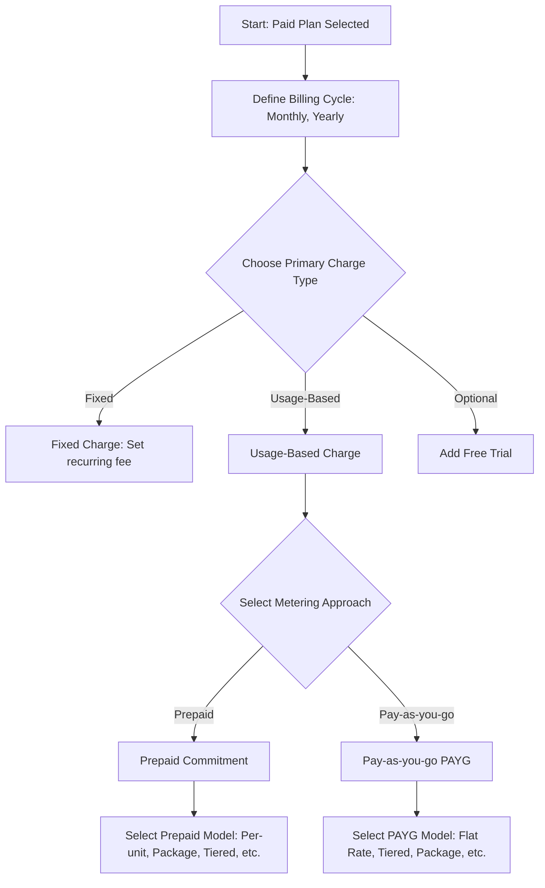
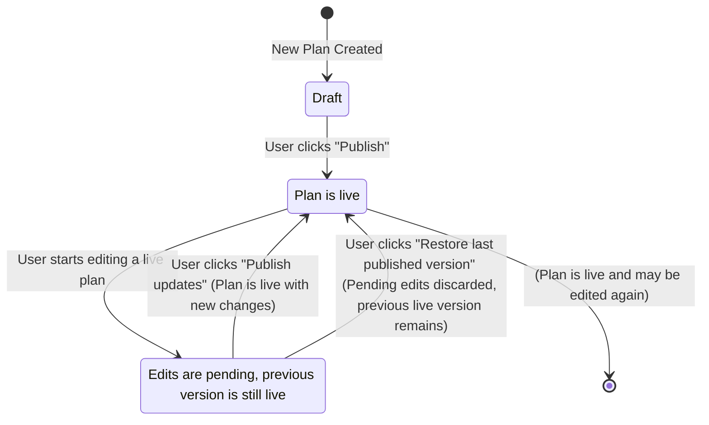

## What is a Plan?

A **Plan** is the commercial package that you offer to your customers. It defines exactly how you monetize your product by bringing together a specific **pricing model**, a set of **features**, and optional **add-ons**. This document provides a complete guide to the entire lifecycle of a plan, from creation and configuration to publishing and management.

---

## Viewing All Plans

To see a comprehensive list of all plans from all of your products, select the **Plans** sub-section from the **Product Catalog** in the left navigation pane. This global view is useful for managing your entire pricing structure in one place.

<Frame>

</Frame>

---

## Creating a Plan

You can create a plan from two primary locations:

1.  Directly from a **Product's detail page** to ensure it's linked to that specific product.
2.  From the global **Plans** tab in the main sidebar navigation.

This guide follows the recommended flow of creating a plan from within a product.

### Step 1: Start from the Product Page

After creating a product, you will see a prompt to create your first plan. Click the **"+ Create plan"** button.

<Frame>

</Frame>

### Step 2: Define the Plan Details

A "Create plan" modal will appear. Fill in the following details:

* **Plan name:** The public name for the plan (e.g., "Starter", "Pro", "Basic").
* **Identifier:** A unique ID for the plan, used to reference it in your code. This is auto-generated but can be overridden.
* **Description:** An optional description that appears on customer-facing elements like invoices and checkout pages.
* **Show this plan...:** Check this box if you want the plan to appear in the ParityDeals pricing table component.

<Tip>
  To create multiple plans quickly, keep the **"Create more"** toggle enabled. When you click "Create", the modal will reset, ready for the next plan's details.
</Tip>

<Frame>

</Frame>

### Step 3: Review Your Draft Plans

Once created, your plans will appear on the product's detail page in a **Draft** state. A draft plan is not yet live and can be safely configured before you publish it.

<Frame>

</Frame>

---

## Configuring a Plan

Click on any draft plan to navigate to its detail page. From here, you will set its price, add features, and associate add-ons.

<Frame>

</Frame>

### Step 1: Set the Price

Click the **"Set price"** button to begin. 

<Frame>

</Frame>

A modal will appear asking you to choose the fundamental plan type.

<Frame>

</Frame>

You have three options for the plan type:

<CardGroup cols={3}>
  <Card title="Free">
    Customers can subscribe to this plan without any charge. Ideal for "Freemium" or "Starter" tiers.
  </Card>
  <Card title="Paid">
    Customers will be charged for this plan based on the pricing you configure (e.g., a recurring fee or usage).
  </Card>
  <Card title="Enterprise/Custom">
    `Coming Soon` — For plans that require custom contracts and manual invoicing.
  </Card>
</CardGroup>

If you select the Free plan, you'll see a success message and can continue with setup.
<Note>To offer a **free trial** for a limited time, you must select the **Paid** plan type.</Note>

### Step 2: Configure the Pricing Model (for Paid Plans)

If you selected a **Paid** plan, you will first define the **Billing Cycle**. After setting the cycle, you can add different types of charges. The decision process for structuring these charges can be visualized as follows:

<CardGroup cols={1}>
  <Card title="Fixed Charges" icon="tag" href="#fixed-charges">
    A recurring flat fee that customers are billed for each billing period. This is often used as the base price for a subscription tier.
  </Card>
  <Card title="Usage-Based Charges" icon="chart-bar" href="#usage-based-charges">
    Fees that customers pay based on their consumption of specific features. You can add one or more usage-based charges to a plan.
  </Card>
  <Card title="Free Trial" icon="gift" href="#free-trial">
    Allows customers to use a paid plan for free for a specific duration.
  </Card>
</CardGroup>

---

## Charge Type Details

This section provides detailed configuration steps for each charge type.

### Fixed Charges

A **Fixed Charge** is a recurring flat fee that customers are billed for each billing period. It serves as the stable, predictable base price of a plan.

<Info>
A plan can only have one fixed charge. Prices are initially set in USD and can be localized into other currencies later.
</Info>

To add a fixed charge:
1. From the plan's detail page, click **"+ Configure pricing"** and select **"Fixed charges"**.
2. Enter the charge amount for each allowed billing period, for example, `$10` for monthly and `$100` for yearly.
3. Click **"Save"** to save the charge.

<Frame>

</Frame>

### Usage-Based Charges

**Usage-Based Charges** are fees that customers pay for their consumption of specific product features. A single plan can have multiple distinct usage-based charges.

The first step is always to **Choose a billable feature** you want to charge for. If the feature doesn't exist yet, you can type its name in the dropdown and create it on the fly.

<Frame>

</Frame>

Once a feature is selected, you must choose how customers will be charged for it:

<Frame>

</Frame>

#### Prepaid Commitment
Customers are billed **upfront** for a specified quantity of usage (like seats or API calls). This model is ideal for creating predictable, recurring revenue from committed customer spend.

<Info>
  **Proration for Upgrades:** When a customer increases their commitment mid-billing period, they are immediately charged a prorated amount for the remainder of the current period. The full, increased amount is charged in subsequent billing cycles.
</Info>

<Tabs>
<Tab title="Flat Rate">
  
Customers commit to a number of units and pay a single, fixed rate for each unit.

  
For example, if the price is `$10` per seat, a customer who commits to `5` seats will pay `$50` at the start of each billing period.

  
To configure this, enter the flat rate per unit. You can also define if usage resets each billing period and set optional minimum or maximum commitment limits. Click `Add` to save.

  <Frame>
   
  </Frame>
</Tab>
<Tab title="Package">
  
Customers commit to one or more packages of units, where each package contains a predefined number of units for a set price.

  
For example, if you sell seats in packages of `5` for `$40`, a customer needing `8` seats must commit to two packages (a total of 10 seats) and will pay `$80` upfront.

  
To configure this, enter the number of units per package and the price per package. Click `Add` to save.

  <Frame>
      
  </Frame>
</Tab>
<Tab title="Tiered">
  
The price per unit typically decreases as the committed usage quantity enters higher tiers. For each tier, you define a unit price for the items falling into that tier. Additionally, ParityDeals allows you to set an optional <strong>flat fee for each tier</strong>, which is added to the per-unit calculation for that tier's portion of the usage.

  
The total commitment cost is calculated by summing the costs from each tier the usage passes through.

  
<strong>Example:</strong> A customer commits to 50 units.

  <ul>
      <li>Tier 1 (covers units 1-10): Optional Tier Flat Fee is `$12`, Per-unit Price is `$10`.</li>
      <li>Tier 2 (covers units 11-50): Optional Tier Flat Fee is `$10`, Per-unit Price is `$15`.</li>
  </ul>
  
Calculation:

  <ul>
      <li>Cost for Tier 1 (first 10 units): Tier 1 Flat Fee (`$12`) + (10 units multiplied by `$10`/unit) = `$112`.</li>
      <li>Cost for Tier 2 (next 40 units): Tier 2 Flat Fee (`$10`) + (40 units multiplied by `$15`/unit) = `$610`.</li>
  </ul>
  
Total commitment cost = `$112 + $610 = $722`.

  
To configure this, define the usage range, per-unit price, and the optional flat fee for each tier. Click `Add` to save.

  <Frame>
      
  </Frame>
</Tab>
<Tab title="Volume">
  
The price for ALL committed units is determined by the single pricing tier that the total committed volume falls into. You can also add an optional <strong>flat fee specific to that tier</strong>, which is added to the total calculated volume charge.

  
<strong>Example:</strong>

  <ul>
    <li>Tier 1 (1-10 units): Per-unit Price is `$10`, Optional Tier Flat Fee is `$0`.</li>
    <li>Tier 2 (11-50 units): Per-unit Price is `$8`, Optional Tier Flat Fee is `$20`.</li>
  </ul>
  
A customer commits to `15` units. This entire commitment falls into Tier 2.

  
Calculation:

  <ul>
    <li>Base Volume Charge: (15 units multiplied by `$8`/unit) = `$120`.</li>
    <li>Tier 2 Flat Fee: `$20`.</li>
  </ul>
  
Total commitment cost = `$120 + $20 = $140`.

  
To configure this, define the usage range, the single price per unit for all units within that tier, and the optional tier flat fee. Click `Add` to save.

  <Frame>
    
  </Frame>
</Tab>
<Tab title="Stair-step">
  
Customers pay a single flat fee for a commitment to a range of usage. This model is typically all-inclusive for the defined step. (`Coming soon`)

  
<strong>Example (Conceptual):</strong> A commitment for "up to 1000 API calls" could cost `$29`, while the next tier for "1001 to 5000 API calls" costs `$79`.

  
(The concept of an *additional* flat fee on top of the tier's primary flat fee is less common for standard stair-step but could be modeled if needed by adjusting the tier's main price).

  
To configure this, define the usage range and the total flat price for that range. Click `Add` to save.

</Tab>
</Tabs>

#### Pay-as-you-go (PAYG) `Coming soon 🚧`
Customers are billed **at the end** of the period based purely on their actual consumption. This model is perfect for variable resources where upfront commitment is difficult, such as for AI tokens, compute time, or data storage.

<Info>
Pay-as-you-go charges can only be added to plans with a **monthly** billing period.
</Info>

<Tabs>
<Tab title="Flat Rate">
  
Customers are charged the same fixed price for every unit they consume. Billing occurs at the end of the period based on actual usage.

  
For example, if you set a price of `$0.01` for every API call, a customer who makes `5,300` calls is billed `$53` at the end of the month.

  
To configure this, enter the price per unit. Click `Add` to save.

  <Frame>
   
  </Frame>
</Tab>
<Tab title="Package">
  
Customers pay for their usage in discrete blocks. Even partial use of a block incurs the cost of the full block. Billing is based on the number of blocks consumed at the end of the period.

  
For example, if data storage is sold in `10 GB` blocks for `$5` each, a customer who uses `12 GB` of data is billed for two blocks. Since they consumed part of a second block, they pay for the full two blocks, for a total of `$10` at the end of the period.

  
To configure this, enter the number of units per block and the price per block. Click `Add` to save.

  <Frame>
     
  </Frame>
</Tab>
<Tab title="Tiered">
  
The unit price for consumed usage typically decreases as consumption enters higher tiers. For each tier, you define a unit price for items consumed within that tier's range. ParityDeals also allows an optional <strong>flat fee for each tier</strong>, which is added to the per-unit calculation if usage occurs in that tier. Billing happens at the end of the period based on total consumption across tiers.

  
The total PAYG bill is calculated by summing the costs from each tier that usage passed through.

  
<strong>Example:</strong> A customer consumes 50 units in a month.

  <ul>
    <li>Tier 1 (covers units 1-10): Optional Tier Flat Fee is `$12`, Per-unit Price is `$10`.</li>
    <li>Tier 2 (covers units 11-50): Optional Tier Flat Fee is `$10`, Per-unit Price is `$15`.</li>
  </ul>
  
Calculation:

  <ul>
    <li>Cost for Tier 1 (first 10 units consumed): Tier 1 Flat Fee (`$12`) + (10 units multiplied by `$10`/unit) = `$112`.</li>
    <li>Cost for Tier 2 (next 40 units consumed): Tier 2 Flat Fee (`$10`) + (40 units multiplied by `$15`/unit) = `$610`.</li>
  </ul>
  
Total PAYG bill = `$112 + $610 = $722`.

  
To configure this, add tiers and define the per-unit price and optional flat fee for each one. Click `Add` to save.

  <Frame>
     
  </Frame>
</Tab>
<Tab title="Volume">
  
The unit price for ALL units consumed is determined by the single pricing tier that the total consumption reaches. An optional <strong>flat fee specific to that tier</strong> can also be added to the total calculated volume charge. Billing occurs at the end of the period.

  
<strong>Example:</strong>

  <ul>
    <li>Tier 1 (1-1000 tokens): Per-unit Price is `$0.02`, Optional Tier Flat Fee is `$0`.</li>
    <li>Tier 2 (1001-10000 tokens): Per-unit Price is `$0.01`, Optional Tier Flat Fee is `$5`.</li>
  </ul>
  
A customer consumes `2,500` tokens in a month. This entire consumption falls into Tier 2.

  
Calculation:

  <ul>
    <li>Base Volume Charge: (2,500 tokens multiplied by `$0.01`/token) = `$25`.</li>
    <li>Tier 2 Flat Fee: `$5`.</li>
  </ul>
  
Total PAYG bill = `$25 + $5 = $30`.

  
To configure this, add tiers and define the single price per unit for that tier, along with the optional tier flat fee. Click `Add` to save.

  <Frame>
       
  </Frame>
</Tab>
<Tab title="Stair-step">
  
Customers are charged a single, predictable flat fee based on the highest usage tier they reach during the billing period. This simplifies billing to a few possible amounts. Billing occurs at the end of the period. (`Coming soon`)

  
<strong>Example (Conceptual):</strong> If the fee for `1-1000` API calls is `$29` and the fee for `1001-5000` calls is `$79`, a customer who makes `1,200` calls is billed `$79` at the end of the period.

  
(The concept of an *additional* flat fee on top of the tier's primary flat fee is less common for standard stair-step but could be modeled if needed by adjusting the tier's main price).

  
To configure this, define the usage range for each tier and the total flat price for that tier. Click `Add` to save.

</Tab>
</Tabs>

#### Adding Multiple Charges
To add another usage-based charge, click the **"+ Add more"** button after saving the previous one. When finished, click **"Continue"**.

### Free Trial

Paid plans can be configured to start with a free trial, giving customers a risk-free way to try your product. These settings can be changed at any time without engineering resources.

#### Defining an Initial Trial
1.  After configuring all charges for a plan, you can enable a trial by checking the **"Provide free trial"** box.
2.  Enter the duration of the trial, for example, `7`, `14`, or `30` days.

<Frame>
    
</Frame>

#### Editing or Removing a Trial
You can modify the trial for a plan at any time:
1.  Navigate to the plan's detail page and find the **Price** section.
2.  Click the edit icon (pencil) and select **"Edit"**.
3.  To change the trial, update the configuration. To remove it, uncheck the "Provide free trial" box.
4.  Click **"Save changes"**.

<Frame>
    
</Frame>

---

## Assigning Features to Plans

Once a plan's pricing is configured, the next step is to define the functionality that customers on this plan are entitled to use. In ParityDeals, the combination of a **feature** and its specific configuration (e.g., on/off, a numeric limit) is called an **entitlement**.

On the plan's detail page, under the "Features" section, you can see all the entitlements assigned to that plan.

<Frame>
   
</Frame>

### Adding Entitlements to a Plan

1.  Click the **"+ Add"** button under the "Features" section of the selected plan.
2.  Search for the features you'd like to assign to the plan and select them from the list.
    <Tip>
      If a feature you need doesn't exist yet, you can type its name and select **"Create new feature"** directly from the dropdown menu without leaving the page.
    </Tip>
    <Frame>
     
    </Frame>
3.  Apply the relevant configuration for each selected feature (see Entitlement Types below).
4.  Confirm the action by clicking the **"Add"** button. The features are now assigned to the plan.

### Entitlement Types

ParityDeals provides several ways to configure feature entitlements to support various business models.

<CardGroup cols={3}>
  <Card title="Switch (Boolean)">
    Simple on/off access. Perfect for features that are either entirely included or excluded from a plan.
  </Card>
  <Card title="Customizable (Limit)">
    Access is governed by a numeric limit that you define.
  </Card>
  <Card title="Metered (Usage)">
    Access is tied to consumption, which can be reported as a pre-aggregated total or as raw events.
  </Card>
</CardGroup>

#### Switch / Boolean
This is the simplest entitlement. It acts as a toggle for a feature.

* **Allowed:** The customer has full access to the feature. For example, enabling "Premium Support" or "Dark Mode".
* **Not Allowed:** The customer does not have access. In a UI powered by ParityDeals, the feature might appear disabled or be hidden behind an upsell prompt.

<Frame>
    
</Frame>

#### Customizable
This entitlement grants access to a feature up to a specific numeric limit you define.

You must enter a numeric value for the limit. For example, allowing up to `10` team members, a `500 MB` maximum file upload size, or `3` connected social media accounts.

You can also toggle **"Enable unlimited usage"**, which effectively grants infinite access to the feature for that plan.

<Frame>
  
</Frame>

#### Metered
A metered entitlement links a feature to its consumption, which is essential for usage-based billing.

* **Pre-aggregated usage:** Your application is responsible for counting usage and reporting the total to ParityDeals periodically. Good examples include total `GB of storage used`, the number of `active projects` in an account, or the `minutes of video rendered`.
* **Raw events:** Your application sends individual event records to ParityDeals (e.g., an event for each API request), and ParityDeals calculates the total usage.

When configuring a metered entitlement, you can grant unlimited usage or set a specific limit. You can also define if the **usage count should reset** each billing period.

The most critical setting for a metered limit is **Limit Enforcement**. This is controlled by a toggle labeled **"Hard Limit (disable usage at zero balance)"**. The state of this toggle determines what happens when a customer consumes all of their allowance. By default, this toggle is **ON** (Hard Limit enabled).

| Toggle State for "Hard Limit" | Effective Behavior | Description                                                                                                                               | Customer Experience                                                                                                                               | Use Case Examples                                                                                                                             |
| :------------------------------------------------------------ | :----------------- | :---------------------------------------------------------------------------------------------------------------------------------------- | :------------------------------------------------------------------------------------------------------------------------------------------------ | :-------------------------------------------------------------------------------------------------------------------------------------------- |
| **ON (Default)** | **Hard Limit** | Access **is** blocked when the usage limit is reached (i.e., balance is zero). ParityDeals will deny further attempts to use the feature.        | The customer is stopped from further usage and is typically shown a message prompting them to upgrade their plan or purchase more units to continue. | Controlling costs strictly, protecting critical resources, ensuring users do not exceed prepaid allowances without an explicit top-up or upgrade. |
| **OFF** | **Soft Limit** | Access is **not** blocked when the usage limit is reached. Usage can go into a negative balance or accrue as overage.                       | The customer can continue using the feature without interruption. This overage can be tracked for insights, to encourage an upgrade, or billed separately if an overage pricing model is configured. | Promoting user growth, avoiding service disruption for non-critical features, or implementing a pay-as-you-go overage model on top of a base allowance. |

<Frame>

</Frame>

### Defining the Entitlement Order
The order of features is critical as it determines their default display order in **paywalls** that are rendered using ParityDeals. You can reorder entitlements to highlight your most important features first. This ordering can be managed in two places:

1.  **From the Plan Details Page:** In the "Features" section of a plan, you can change the order by using the drag-and-drop handle that appears on the left of each feature row. This sets the default order for this specific plan.

    <Frame>
       
    </Frame>

2.  **From the Paywall Editor:** You can also override the default order for a specific paywall directly within the Paywall editor, using a similar drag-and-drop interface.

    <Frame>
     
    </Frame>

### Removing Entitlements from a Plan

If a feature should no longer be part of a plan, you can easily remove its entitlement.

1.  On the plan's detail page, find the feature you wish to remove in the "Features" list.
2.  Click the **three-dot menu icon** on the right side of the feature's row.
3.  Select the **"Remove feature"** action from the dropdown menu.
4.  A confirmation dialog will appear. Click **"Remove feature"** to permanently remove the entitlement from the plan.

<Frame>
     
</Frame>

### Customizing Entitlement Display Text

While features have a default name, you often need more customer-friendly or descriptive text for your paywalls. ParityDeals allows you to override the default text for any entitlement on a specific paywall.

1.  From the sidebar, navigate to **Monetization > Paywalls**.
2.  Select the paywall you wish to edit from the list.
3.  In the paywall editor, find the plan you want to modify and locate its feature list.
4.  Click the **three-dot menu icon** next to the feature you want to customize and select **"Edit"**.

    <Frame>
     
    </Frame>

5.  A form will appear with the following fields:
    * **Customer display text:** This is the main text the customer will see for the feature in the paywall (e.g., changing "api_calls_limit" to "Monthly API Requests").
    * **Tooltip description:** Add a longer, more descriptive explanation that will appear when a customer hovers over an info icon next to the feature.

    <Tip>
    The original default text for both fields is shown at the bottom of the form. You can easily copy this value if you ever need to revert back to the default.
    </Tip>

    <Frame>
      
    </Frame>

6.  Click **"Save"** to apply the changes to your paywall.
---
## Publishing and Managing Plans

This section guides you through the final steps of the plan lifecycle: making your plans live and managing all subsequent updates.

### Publishing a Plan

After a plan has been fully configured with its pricing, features, and entitlements, it remains in a **Draft** state. To make it available for new customer subscriptions, you must publish it.

1.  Navigate to the draft plan you want to make live.
2.  Click the **"Publish"** button, typically located in the top-right corner of the plan details page.
3.  A confirmation dialog will appear. Review the summary and confirm the action.

The plan is now live and can be integrated into your paywalls and checkout flows.

<Frame>
     
</Frame>

### Editing Published Plans

One of the core strengths of ParityDeals is the ability to make rapid changes to live plans without requiring engineering resources. This allows your product and growth teams to iterate on your pricing and packaging quickly.

When you publish an update to a plan, you can decide how the changes are applied:

* **For New Customers Only:** This is the standard for most pricing changes. Any customer who subscribed before this update will remain on their original plan and price. All new subscribers will get the updated plan.
* **For New AND Existing Customers:** This is ideal for additive changes that benefit all users. For example, when you add a valuable new feature to a plan, you can roll it out to every existing subscriber on that plan simultaneously.

#### Making and Publishing Changes

1.  To edit a live plan, navigate to the side panel in **Product Catalog > Plans**.
2.  Click the **three-dot menu icon** on the relevant plan and select the **"Edit"** action.

    <Frame>
     
    </Frame>

3.  Apply any changes to the plan's pricing, features, or other details.
4.  Once a change is made, the plan will have unpublished updates. ParityDeals clearly indicates this with an **"Unpublished changes"** badge and a **yellow border** around the plan details section.

5.  To make your changes live, click the **"Publish updates"** button in the top corner of the page. This will open a dialog where you can confirm the changes and choose how to roll them out.

    <Frame>
     
    </Frame>

#### Restoring a Previous Version
If you make a mistake or wish to discard your unpublished changes, you can easily revert to the last published version.

1.  On a plan's detail page that has unpublished changes, click the **three-dot menu icon** located next to the "Publish updates" button.
2.  Select the **"Restore last published version"** option from the dropdown menu.

    <Frame>
        
    </Frame>

3.  A confirmation modal will appear, asking if you are sure. Click **"Restore version"** to confirm the action.

All of your pending changes will be discarded, and the plan will instantly revert to its last live state.

<Frame>
    
</Frame>

#### Visualizing the Plan Lifecycle

The lifecycle of a plan involves several key states, from its creation as a draft to being published and subsequently updated. The following diagram illustrates these transitions:

